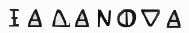
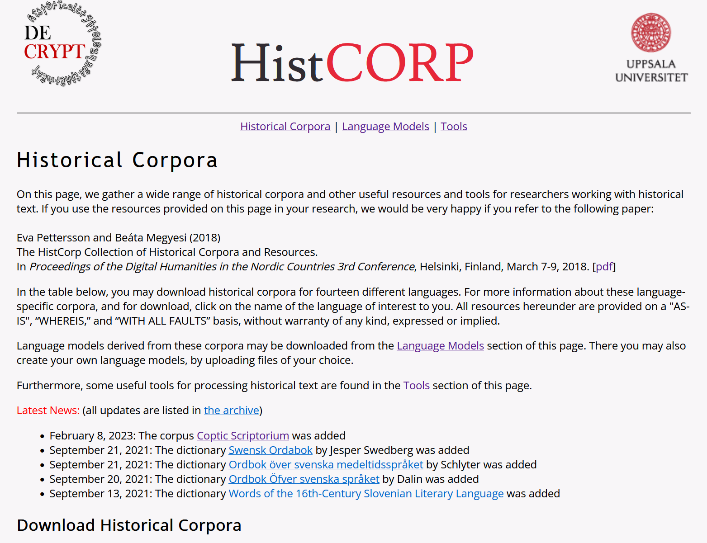
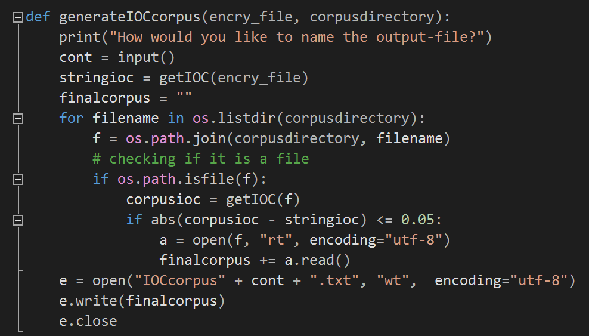
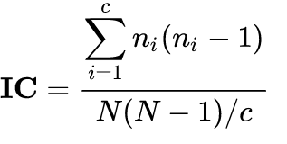
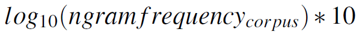
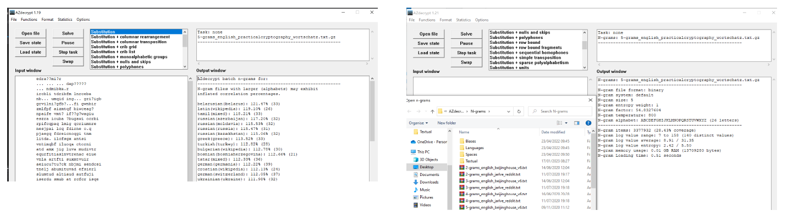
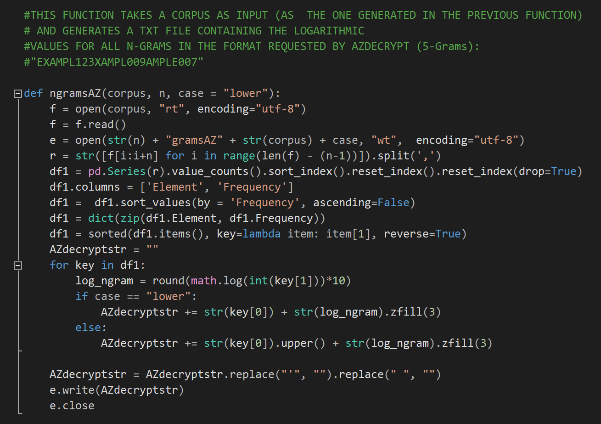

  

This codebase has been developed to power the following research paper:

Palma, C. (2023). Encrypted epigraphy: The case of a mysterious inscription in the Neapolitan church of Santa Maria La Nova. Proceedings of the 6th International Conference on Historical Cryptology HistoCrypt 2023, 139–147. Published on May 30, 2023.

If you are using it for publication purposes, please use the provided citation.

The main available tool for deciphering Historical ciphers is currently (CrypTool 2)[https://www.cryptool.org/en/ct2/].
It offers a wide choice of de- and encryption algorithms in a beautiful and interactive User Experience.
Although the provided clear-text languages are updated at every release, they are fix and not customizable.
The major added value of this contribution is providing a workflow for generating n-grams files from customized historical corpora.
A notable source for downloading historical corpora is (HistCorp)[https://www2.lingfil.uu.se/person/pettersson/histcorp/].

  

After selecting an historical corpus, it is necessary to pre-process it. The present codebase provides also functions to achieve this,
such as:

  

and:

  

  

  

  

  

  

  

  

